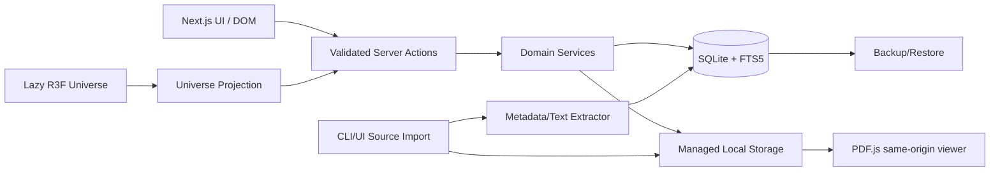

# Technical Blueprint

## 1. Architecture decision summary

Ứng dụng MVP là một **local-first full-stack web chạy bằng Node**, không phải static export và không cần cloud account.

Stack đề xuất:

- Next.js App Router + React + TypeScript strict.
- Three.js thông qua React Three Fiber cho universe canvas; load client-only và có DOM/SVG fallback.
- CSS custom properties + Tailwind utility hoặc CSS Modules cho layout; không lấy component template làm visual identity.
- Accessible headless primitives cho dialog/popover/menu; style hoàn toàn theo design tokens.
- SQLite file local; Drizzle ORM/migrations; adapter ưu tiên `better-sqlite3`, có decision gate nếu Node hiện tại không tương thích.
- SQLite FTS5 cho full-text search; fallback search nếu runtime không có FTS5.
- Tiptap/ProseMirror JSON cho rich user content; lưu thêm plain text để search. Không execute user MDX/JSX.
- PDF.js cho source viewer.
- Zod cho validation tại mọi mutation/import boundary.
- Vitest + React Testing Library cho unit/component; Playwright + axe cho E2E/accessibility.

Agent triển khai phải kiểm tra version/compatibility hiện hành trước khi install và pin lockfile. Tài liệu chính thức tham khảo:

- [Next.js App Router](https://nextjs.org/docs/app)
- [Next.js data mutations](https://nextjs.org/docs/app/getting-started/mutating-data)
- [React Three Fiber repository](https://github.com/pmndrs/react-three-fiber)
- [React Three Fiber scaling performance](https://r3f.docs.pmnd.rs/advanced/scaling-performance)
- [PDF.js getting started](https://mozilla.github.io/pdf.js/getting_started/)
- [SQLite FTS5](https://www.sqlite.org/fts5.html)
- [Playwright accessibility testing](https://playwright.dev/docs/accessibility-testing)

## 2. Vì sao chọn local Node + SQLite

- Người dùng sở hữu PDF và dữ liệu; không cần gửi tài liệu lên cloud.
- CRUD, source import, text extraction, backup và file streaming cần server runtime.
- SQLite đơn giản để backup, search và migrate hơn IndexedDB khi data model đã có nhiều relation.
- App vẫn mở ở `localhost`, nhưng sau này có thể thêm auth/sync mà không thay domain model.

Không dùng `output: 'export'`: static output không có runtime cần thiết cho write database/file. Server mặc định bind loopback; chỉ mở LAN khi người dùng chủ động cấu hình.

## 3. High-level architecture



### Boundary rules

- Server Components đọc data; Client Components chỉ nhận DTO cần thiết.
- Server Actions dành cho mutation, không dùng để làm polling/query loop.
- Route Handlers dùng cho PDF/file stream, search suggest nếu cần, backup download và import upload.
- Domain service không import React/Next APIs; test độc lập được.
- Scene nhận `UniverseNodeDTO[]`; không query DB trực tiếp và không chứa business rules.
- Renderer/editor không được inject raw unsanitized HTML.

## 4. Proposed project tree

```text
s32k144-learning-universe/
├─ AGENTS.md
├─ README.md
├─ app/
│  ├─ (universe)/page.tsx
│  ├─ knowledge/[slug]/page.tsx
│  ├─ labs/[slug]/page.tsx
│  ├─ library/page.tsx
│  ├─ review/page.tsx
│  ├─ sessions/...
│  ├─ sources/[sourceId]/page.tsx
│  ├─ settings/page.tsx
│  ├─ api/sources/[sourceId]/file/route.ts
│  ├─ api/backup/route.ts
│  └─ actions/...
├─ components/
│  ├─ app-shell/
│  ├─ universe/
│  ├─ knowledge/
│  ├─ board/
│  ├─ labs/
│  ├─ review/
│  ├─ editor/
│  ├─ sources/
│  └─ ui/
├─ lib/
│  ├─ db/
│  │  ├─ schema.ts
│  │  ├─ migrations/
│  │  ├─ client.ts
│  │  └─ seed.ts
│  ├─ domain/
│  ├─ validation/
│  ├─ search/
│  ├─ universe/
│  ├─ sources/
│  ├─ backup/
│  └─ content/
├─ config/source-manifest.json
├─ content/seed/
│  ├─ universe.json
│  ├─ topics/
│  ├─ labs/
│  └─ review-cards/
├─ public/
│  ├─ fonts/
│  └─ static-fallback/
├─ storage/                 # .gitignore
│  ├─ app.db
│  ├─ sources/
│  ├─ attachments/
│  └─ backups/
├─ scripts/
│  ├─ import-sources.ts
│  ├─ seed-content.ts
│  ├─ verify-sources.ts
│  └─ export-backup.ts
├─ tests/
│  ├─ unit/
│  ├─ integration/
│  ├─ e2e/
│  └─ visual/
└─ docs/
```

Không tạo source code ngoài project root. `storage/` và file PDF phải bị ignore từ commit đầu tiên.

## 5. Domain model

ID nên dùng UUIDv7/ULID để tạo local, sort theo thời gian và không phụ thuộc integer row id khi export/import.

### `workspaces`

Cho phép mở rộng multi-board nhưng MVP seed một workspace.

| Field | Notes |
|---|---|
| `id` | stable ID |
| `slug` | `s32k144` |
| `title` | display name |
| `description` | short |
| `settings_json` | units, locale, visual config |
| timestamps | created/updated |

### `knowledge_nodes`

Entity trung tâm cho Sun/planet/moon/topic/register/pin/note.

| Field | Notes |
|---|---|
| `id`, `workspace_id` | keys |
| `parent_id` | hierarchy; nullable for Sun/root |
| `node_type` | domain/topic/register/pin/note/lesson/... |
| `astronomy_key` | sun/mercury/...; nullable for normal node |
| `slug` | unique within workspace |
| `title`, `summary` | user-facing |
| `body_json` | canonical editor document |
| `body_text` | derived searchable plain text |
| `aliases_json` | register/net/English/Vietnamese aliases |
| `status` | draft/published/deprecated |
| `verification_state` | draft/sourced/hardware-verified/reviewed |
| `difficulty` | 1–5 nullable |
| `applicability_json` | device/package/board/revision |
| `visual_json` | color/material/icon/size override |
| `orbit_order`, `sort_order` | deterministic placement |
| `created_by` | local-user/import/AI label |
| `created_at`, `updated_at`, `deleted_at` | soft delete/audit |

### `node_relations`

Directed relation; unique `(from_id, to_id, relation_type)`.

Types seed:

- `prerequisite-of`
- `related-to`
- `uses-pin`
- `uses-register`
- `uses-clock`
- `implemented-by-lab`
- `captured-in-lesson`
- `verified-by`
- `supersedes`

### `sources`

| Field | Notes |
|---|---|
| `id` | same as manifest when seeded |
| metadata | title/vendor/revision/date/kind |
| `original_path` | informational, never sent broadly to client |
| `managed_path` | relative under storage |
| `sha256`, `bytes`, `page_count` | integrity |
| `import_status` | registered/missing/importing/ready/error |
| `mismatch_json` | filename/internal title warning |
| timestamps | imported/verified |

### `source_pages`

- `source_id`, `page_number` unique.
- `printed_label`, `heading`, `text_content` optional.
- `extraction_status`, `text_hash`.
- Chỉ lưu local; có thể rebuild từ PDF.
- FTS index title/heading/text, nhưng source page result luôn liên kết về PDF.

### `source_refs`

- `node_id` hoặc polymorphic target (`target_type`, `target_id`).
- `source_id`, page start/end, chapter, section, locator, relevance.
- `verified_at`, optional note.
- DB check page >=1; service check page <= source.page_count.

### `tags` / `node_tags`

Tag normalized; display label giữ case. Seed tags: `gpio`, `port`, `clock`, `irq`, `polling`, `dma`, `board`, `electrical`, `beginner`, `q100`.

### `labs` and `lab_steps`

`labs` có slug/title/objective/difficulty/estimated_minutes/hardware_json/starter_code/solution_code/status. Mỗi lab liên kết một knowledge node để xuất hiện trong universe.

`lab_steps` có order/type/title/instruction/expected/evidence_type/hints_json/source refs. Evidence type có thể là `understood`, `hardware-confirmation`, `observation`, `quiz`.

### `lab_progress`

Single-user vẫn dùng record riêng để dễ mở rộng: lab id, status, current step, started/completed, hardware_verified, observations JSON và code snapshot.

### `lesson_sessions`

Date, duration, goals, summary body, mistakes, open questions, next actions; relations tới nodes/labs/cards.

### `review_cards` / `review_history`

Card types: Q/A, cloze, register decode, code ordering, board pin mapping. Fields gồm prompt/answer JSON, source node, due date, interval, stability/ease, difficulty, lapse count, suspended.

History là append-only: reviewed_at, grade 1–4, elapsed, previous/new scheduling values.

### `content_versions`

MVP có thể lưu snapshot trước mutation cho node/lab/lesson. Tối thiểu giữ 20 revision/entity hoặc retention cấu hình. Soft delete có thể restore.

## 6. Universe projection and layout

Business data không lưu raw random coordinates làm canonical.

```ts
type UniverseNodeDTO = {
  id: string
  parentId: string | null
  kind: 'sun' | 'planet' | 'moon' | 'asteroid' | 'comet'
  title: string
  astronomyLabel?: string
  summary: string
  route: string
  colorToken: string
  sizeWeight: number
  orbitRing: number
  orbitOrder: number
  progress: number
  dueCount: number
  verificationState: string
}
```

Layout function thuần nhận seed/order + viewport + focus level và trả transform. Yêu cầu:

- Deterministic giữa reload và test.
- Stable khi thêm node: hạn chế làm mọi moon cũ nhảy vị trí.
- Cluster khi > ngưỡng; chỉ expand cluster đang focus.
- User override lưu `orbit_order`/visual metadata, không lưu camera state vào node.
- Camera/focus state nằm trong URL (`?focus=<id>&level=moon`) để back/forward/share hoạt động.

R3F scene dynamic import với `ssr:false`; DOM navigator render từ cùng DTO trước canvas. Error boundary chuyển sang SVG/CSS projection.

## 7. Route and action contract

### Read routes

| Route | Data |
|---|---|
| `/` | universe projection + continue/due summary |
| `/library` | paged/filter tree/list |
| `/knowledge/[slug]` | node, refs, relations, linked labs |
| `/labs/[slug]` | lab, steps, progress |
| `/sessions/[id]` | lesson + links/cards |
| `/review` | due card queue |
| `/sources/[id]` | source metadata + viewer shell |
| `/progress` | aggregates, no raw history dump by default |

### Server actions

- `createNode`, `updateNode`, `moveNode`, `softDeleteNode`, `restoreNode`.
- `createRelation`, `deleteRelation`.
- `attachSourceRef`, `verifySourceRef`.
- `createLab`, `updateLab`, `saveLabProgress`, `completeLab`.
- `createLesson`, `generateCardFromSelection` (deterministic form, AI optional later).
- `gradeReviewCard`, `suspendReviewCard`.
- `updateSettings`.

Mỗi action:

1. Parse Zod schema.
2. Check workspace/entity existence and local permission boundary.
3. Run transaction.
4. Write content version/audit metadata.
5. Rebuild derived `body_text`/FTS rows.
6. Revalidate affected route/projection.
7. Return typed success/error, không leak filesystem path/stack.

### Route handlers

- `GET /api/sources/:id/file` hỗ trợ range requests/same-origin PDF stream.
- `POST /api/sources/import` cho browser upload, có size/type/hash validation.
- `GET /api/backup` tạo export stream.
- `POST /api/restore/validate` chỉ validate/preview; restore là action riêng có confirmation.
- Optional `GET /api/search?q=` nếu command palette không dùng server action.

## 8. Source import pipeline

### Seed/local CLI path

Command mục tiêu sau khi scaffold:

```powershell
npm run sources:verify
npm run sources:import -- --manifest .\config\source-manifest.json
```

Pipeline:

1. Đọc manifest và kiểm file tồn tại.
2. Tính SHA-256, bytes, page count; dừng nếu mismatch và hiện diff.
3. Copy atomically vào `storage/sources/<source-id>.pdf` hoặc register read-only path theo setting; mặc định copy để portable.
4. Upsert source metadata.
5. Extract page text/heading trong background process có progress; không block app boot.
6. Rebuild FTS source page rows.
7. Mark ready và chạy deep-link smoke test.

### Browser upload

- Accept PDF only theo magic bytes + MIME, không chỉ extension.
- Size limit configurable; stream to temp, hash, rồi atomic move.
- Không overwrite source có hash khác mà không explicit replace flow.
- Replace source giữ citation nhưng đánh dấu refs cần re-verify nếu page count/hash đổi.

### PDF viewer

- Serve same-origin; browser không đọc `file://D:/Downloads`.
- Worker file self-hosted.
- Deep link 1-based page.
- Split view từ article; search trong PDF nếu text index có sẵn.
- Error source missing cho phép relink theo hash.

## 9. Rich content model

Canonical body là ProseMirror/Tiptap JSON với whitelist node types:

- paragraphs/headings/lists/table.
- code block với language.
- callout: info/warning/hardware/debug.
- register table.
- source reference inline/block.
- image/attachment local.
- lab/link cards.

Không cho raw script/iframe/style. Render bằng component mapping, không `dangerouslySetInnerHTML` từ dữ liệu chưa sanitize. Store plain text derived trong cùng transaction.

Seed content có thể author bằng Markdown trong repo rồi convert qua importer. Không execute MDX expression; custom directive parser phải deterministic.

## 10. Search design

FTS index các trường:

- title với weight cao nhất.
- aliases/register/net names.
- summary.
- body plain text.
- tags/planet.
- source heading/locator/page text với result group riêng.

Ranking kết hợp FTS BM25 + exact prefix bonus + recently used nhẹ. Không để recent note vượt exact register match. Search response gồm snippets đã escape.

Command palette parse:

- plain text.
- filter `type:`, `planet:`, `tag:`, `source:` sau MVP.
- commands bắt đầu `>`.

FTS5 availability phải được test lúc startup/migration. Nếu thiếu, app vẫn usable bằng normalized `LIKE`/in-memory title search và hiển thị degraded status.

## 11. Review scheduler boundary

Tạo interface để thuật toán thay được:

```ts
interface ReviewScheduler {
  preview(card: ReviewState, now: Date): RatingPreview[]
  grade(card: ReviewState, rating: 1 | 2 | 3 | 4, now: Date): ReviewState
}
```

MVP có thể dùng Leitner/SM-2-inspired deterministic implementation. Không gọi nó là FSRS nếu chưa implement/kiểm thử đúng thuật toán. Luôn lưu history để migrate scheduler.

## 12. Backup, restore and migration

Backup portable gồm:

- `manifest.json`: app/schema version, created time, hashes.
- `data.jsonl` hoặc normalized JSON theo entity.
- attachments optional.
- PDFs excluded mặc định; source metadata/hash vẫn có.

Restore flow:

1. Upload/select backup.
2. Validate schema/hash và hiển thị preview counts/conflicts.
3. User chọn new workspace/merge/replace. `Replace` là destructive và phải backup current DB trước.
4. Transaction import; rollback toàn bộ khi lỗi.
5. Rebuild FTS/derived data.

DB migration chạy trước app readiness, có copy backup của DB. Không tự xóa DB khi migration fail.

## 13. Security and safety

Local app vẫn coi mọi mutation endpoint là public request:

- Validate và authorize workspace/entity trong action.
- CSRF/cookie defaults theo framework; không bind `0.0.0.0` mặc định.
- Sanitize filenames, không dùng filename làm path trực tiếp.
- Resolve managed path và kiểm luôn nằm trong `storage/` trước read/write.
- Prevent path traversal và symlink escape.
- Limit upload size/page count/extraction time.
- Escape search snippets và source text.
- Security headers phù hợp với PDF worker/WebGL; CSP không cho arbitrary script.
- Secret/API key sau này chỉ ở server env, không xuất client bundle.

## 14. Performance plan

### Loading strategy

- Render app shell, Sun/planet DOM nav và current progress server-side.
- Lazy load R3F/Three only on universe route.
- Lazy load PDF.js/editor only khi mở.
- Preload target route on focus, không preload mọi moon.
- Use server pagination cho library/source search.

### Scene budget khởi điểm

- Overview draw calls mục tiêu <100; reuse geometry/material, instance stars/asteroids.
- Không shadow map cho mọi planet; baked/procedural rim light.
- Dynamic DPR cap, mục tiêu 1–1.5 tùy quality.
- Pause when document hidden.
- On-demand render khi reduced motion/scene idle; ambient mode hạ update rate nếu cần.
- Dispose texture/geometry khi unmount/context switch.

### UX budgets

- DOM shell usable trước scene.
- Article LCP local mục tiêu <2.5 s trên hardware trung bình.
- Search title/topic feedback <150 ms với DB seed mục tiêu.
- Focus camera + inspector không block main thread kéo dài.
- Mobile low tier không tải postprocessing chunk.

## 15. Test strategy

### Unit

- Zod schemas.
- Universe deterministic layout/cluster.
- Source page validation and citation formatter.
- Review scheduler.
- Slug/alias normalization.
- Import manifest/hash mismatch.
- Backup serialization/migration.

### Integration

- CRUD transaction + version history + FTS update.
- Source import to managed storage.
- Soft delete/restore.
- Lab progress and hardware verification state.
- Backup → clean DB restore equivalence.
- Replace source marks refs stale.

### Component

- DOM universe navigator keyboard behavior.
- Inspector focus/back.
- Editor required fields and source picker.
- Register table/code block/source chip.
- Review rating keyboard.
- PDF viewer missing/relink state.

Không phụ thuộc vào experimental R3F renderer cho logic cốt lõi; scene mapping/layout là pure functions. Canvas có E2E smoke + fallback tests.

### E2E critical paths

1. Home → Jupiter → RGB → lab.
2. Create note → attach source → save → search → reload.
3. Complete lab checkpoint → hardware verify → progress update.
4. Create card → due review → grade → due date changes.
5. Open source page deep link → refresh same page.
6. Export backup → import clean fixture → data matches.
7. WebGL disabled → full navigation still works.
8. Reduced-motion → no continuous camera/planet movement.

### Accessibility

- axe scans cho home fallback, article, lab, editor, review.
- Manual keyboard only cho 5 journeys.
- Screen-reader smoke cho navigator/inspector/editor toolbar.
- Contrast/focus/touch target audit.

### Visual regression

Theo viewport trong `UX_UI_SPEC.md`; dùng deterministic scene seed/time để screenshot ổn định.

## 16. Environment and scripts target

Agent Phase 0 nên tạo scripts tương đương:

```json
{
  "dev": "next dev",
  "build": "next build",
  "start": "next start",
  "lint": "eslint .",
  "typecheck": "tsc --noEmit",
  "test": "vitest run",
  "test:e2e": "playwright test",
  "db:migrate": "...",
  "db:seed": "...",
  "sources:verify": "...",
  "sources:import": "...",
  "backup": "..."
}
```

Không copy literal `...`; chọn CLI cụ thể theo packages đã xác minh. Cần `.env.example` tối thiểu:

```text
APP_HOST=127.0.0.1
APP_PORT=3000
DATABASE_PATH=./storage/app.db
STORAGE_ROOT=./storage
SOURCE_IMPORT_MODE=copy
```

Path resolve trên server từ project root; không dựa vào current shell directory một cách mơ hồ.

## 17. Implementation phases

### Phase 0 — Foundation

- Inspect Node/npm/toolchain.
- Scaffold app, strict TS, lint/test, tokens, app shell.
- DB schema/migration/seed skeleton.
- Storage and source verification CLI.
- CI/local quality command.

Exit: app boot, migration/seed deterministic, test baseline green, không sửa file ngoài project.

### Phase 1 — Vertical slice

- Seed Sun + 8 planets + selected Jupiter moons.
- Universe DOM nav + R3F scene + fallback.
- Jupiter inspector, RGB topic article, source chip.
- `Blink RGB Red` lab.
- Create/edit quick note persisted.

Exit: một journey hoàn chỉnh đẹp, data thật, refresh-safe, desktop/mobile.

### Phase 2 — Knowledge platform

- Full CRUD, relations, tags, editor.
- Search/command palette.
- PDF import/viewer/page refs.
- Library/list and backup/export.

### Phase 3 — Learning loop

- Lesson summaries.
- Lab runner/progress/evidence.
- Review cards/scheduler/history.
- Paths/prerequisites and seed curriculum.

### Phase 4 — Polish

- Board explorer.
- Quality tiers/performance.
- Accessibility/manual audits.
- Visual regression, recovery/error states, docs.

## 18. Vertical slice acceptance criteria

Phase 1 không được coi là xong nếu thiếu bất kỳ điều nào:

- Sun và planets lấy từ DB/seed, không hard-code JSX từng object.
- Focus/back hoạt động với URL/history.
- Jupiter có board moons; RGB mapping đúng PTD15/PTD16/PTD0 và active-low.
- Article có ít nhất một source ref mở schematic đúng page.
- Lab giải thích PCC/PORT/GPIO flow, không chỉ paste code.
- Note mới lưu DB, tìm lại được và tồn tại sau server restart.
- Keyboard/list fallback hoàn thành cùng journey.
- Mobile 390 px dùng được; reduced-motion dừng ambient animation.
- Typecheck/lint/unit/E2E critical path pass.

## 19. Open decision gates cho agent Phase 0

Chỉ các điểm sau cần xác minh môi trường, không phải hỏi lại product intent:

1. Node version hiện có và package manager.
2. SQLite driver tương thích Windows/Node; nếu `better-sqlite3` fail, chọn local libSQL adapter và ghi rationale.
3. Tiptap/React/Next version compatibility.
4. WebGL baseline của browser/GPU hiện tại để đặt quality default.
5. Toolchain `arm-none-eabi-gcc`/S32DS có tồn tại không; chỉ ảnh hưởng compile check của lab, không block web MVP.

Mọi quyết định phải ghi vào `IMPLEMENTATION_STATUS.md` và không làm thay đổi mục tiêu sản phẩm.

